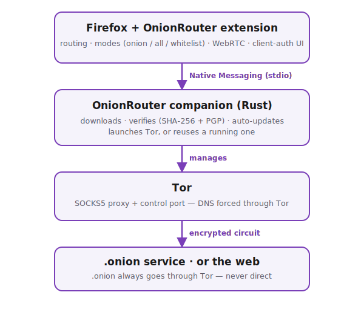

<div align="center">


# OnionRouter

**Visit `.onion` sites in Firefox — no Tor Browser, no setup.**

OnionRouter routes `.onion` (and, if you want, all) traffic through Tor
automatically. Tor itself is downloaded, verified, launched and kept up to date
for you in the background.

[](https://addons.mozilla.org/firefox/addon/onionrouter/)
[](https://addons.mozilla.org/firefox/addon/onionrouter/)
[](https://github.com/LouisCourrian/OnionRooter/actions/workflows/ci.yml)
[](LICENSE)

</div>

---

## Install

OnionRouter has two parts: a **Firefox extension** (the UI) and a small
**companion** (a native app that manages Tor). You need both.

**1. Companion** — [**download the latest release**](https://github.com/LouisCourrian/OnionRooter/releases/latest)
- **Windows:** run `OnionRouter-Setup-x.y.z.exe` (per-user, no admin needed).
- **Debian/Ubuntu:** `sudo apt install ./onionrouter-companion_x.y.z_amd64.deb`

**2. Extension** — [**get it from Firefox Add-ons**](https://addons.mozilla.org/firefox/addon/onionrouter/)

Then open any `.onion` address — Tor starts automatically.

## Features

- 🧅 **Automatic `.onion` routing** — visit any onion site, Tor spins up on demand.
- 🔀 **Three modes** — onion-only, everything-via-Tor, or a custom whitelist.
- 🛡️ **No leaks** — DNS goes through Tor (`proxyDNS`); WebRTC kill-switch.
- 📦 **Managed Tor** — official Tor Expert Bundle, **SHA-256 + PGP verified**,
  **auto-updated** to the latest version (with a pinned fallback).
- ♻️ **Reuses your Tor** — detects a running Tor Browser / system Tor (incl.
  SAFECOOKIE auth) instead of launching a second one.
- 🔑 **Private (client-auth) services** — store the key for restricted `.onion`
  services; keys are encrypted (OS keystore or passphrase) and **never touch the
  browser profile**.
- 🩺 **Diagnostics page** — see exactly what's happening when something doesn't.
- 🔏 **Signed releases** — installer + Debian package are GPG-signed; the
  extension is signed by Mozilla.

## How it works

<div align="center">
  
</div>

The extension never speaks to Tor directly: it asks the companion to provide a
verified Tor backend, then routes each request through `127.0.0.1:<socks>` with
DNS forced through Tor. See [docs/TECHNICAL.md](docs/TECHNICAL.md) for details
and [CAHIER_DES_CHARGES.md](CAHIER_DES_CHARGES.md) for the functional scope.

## Security at a glance

- Tor archives are refused unless their **SHA-256 matches**; auto-update
  additionally **verifies the Tor Project's PGP signature** on the checksums.
- Client-auth private keys live only in the companion — **OS-encrypted (DPAPI /
  Keychain / Secret Service)** or **passphrase-encrypted (Argon2id +
  XChaCha20-Poly1305)** — and the on-disk index stores only a **hash** of each
  protected address.
- The companion's **update check is routed through Tor**, so checking for a new
  version doesn't leak your IP.
- Release artifacts are **GPG-signed**; verify with the public key in
  [`docs/`](docs/onionrouter-signing-key.asc).

## Build from source

```bash
# Companion (Rust)
cargo build  --release --manifest-path companion/Cargo.toml
cargo test            --manifest-path companion/Cargo.toml

# Windows installer + XPI
powershell -ExecutionPolicy Bypass -File installer/build.ps1

# Debian package
bash installer/linux/build-deb.sh
```

Load the extension temporarily via `about:debugging` → *Load Temporary Add-on*
→ `extension/manifest.json`.

**Releases** are automated by `.github/workflows/release.yml`, with companion
and extension versioned independently:

```bash
git tag companion-v1.0.0   # → Windows installer + Debian package
git tag ext-v1.0.0         # → submit the extension to addons.mozilla.org
```

## Contributing

Personal project — pull requests aren't accepted at this time. Bug reports and
feedback are welcome via [issues](https://github.com/LouisCourrian/OnionRooter/issues).

## License

[MIT](LICENSE) © Louis COURRIAN.
